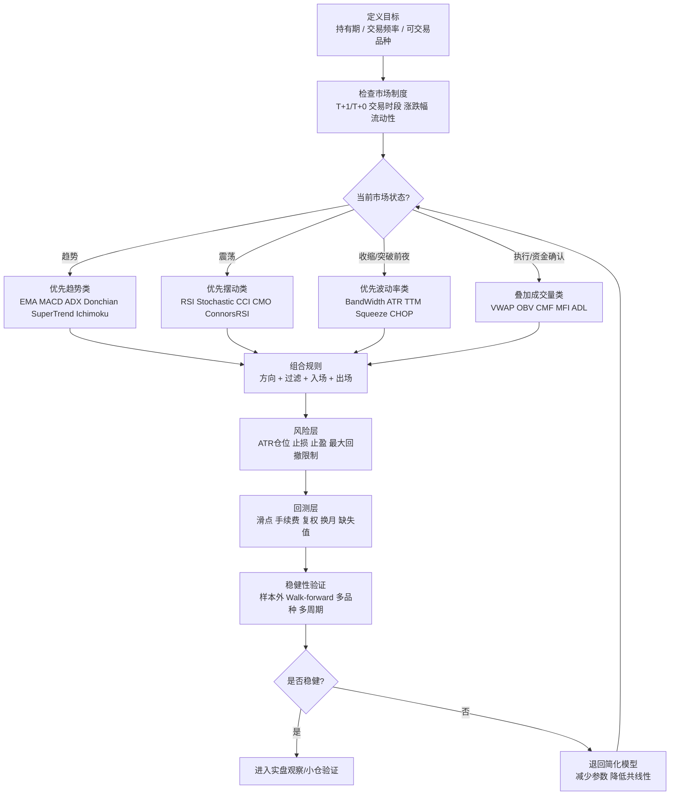

# 股票技术指标分析报告

## 执行摘要

本报告面向中级到高级交易者，目标不是罗列“几个常见指标”，而是建立一个**可用于教学、实盘与量化回测的指标地图**：把趋势、摆动、成交量、波动率、动量、周期/频谱、统计/机器学习、复合/自适应与少见/学术指标放进同一评价框架，讨论它们的**定义、公式、参数、信号、适用市场、优缺点、滞后/领先属性，以及对手动、量化和高频交易的适配性**。需要先说明一点：严格意义上的“全部指标”并不存在统一边界。仅 entity["organization","Cboe","chicago, illinois, us"] 之外的技术分析库生态里，TA-Lib 已收录约 200 个指标/函数，pandas-ta 也收录 150 余项指标与工具；不同平台还会继续派生专有复合指标，所以更现实的目标是覆盖**核心家族 + 重要变体 + 代表性学术指标**。citeturn11search19turn11search14turn6search16

从实务角度看，技术指标没有“万能圣杯”，只有“**适配的市场状态**”。在单边趋势里，均线、ADX、唐奇安、SuperTrend、Ichimoku 一类更有效；在区间震荡里，RSI、Stochastic、CCI、CMO、ConnorsRSI 更直接；在突破前夜，布林带收口、TTM Squeeze、Choppiness Index、ATR 扩张更重要；在执行层面，VWAP、Anchored VWAP、OBV、CMF、MFI、Chaikin 系列对资金行为更敏感。周期/频谱类与统计滤波类指标则更适合做**“状态识别器”**或量化特征，而不是孤立地下单按钮。citeturn7search11turn13view1turn14view2turn34view1turn34view0turn16search10turn31view3

如果只能记住三点：第一，**先判断市场状态，再选指标**；第二，**避免使用高度同质化指标堆叠**，否则只是“重复投票”；第三，**任何参数优化都必须接受样本外与稳健性检验**，因为回测过拟合在交易研究中极其常见。citeturn38search6turn40view0

## 评价框架与市场适配

我建议用五个维度看任何技术指标。其一，**信息来源**：价格、成交量、波动率、订单流代理、跨资产关系。其二，**时序属性**：领先、同步、滞后。其三，**输出形态**：方向型、区间型、阈值型、通道型、滤波型。其四，**市场状态**：趋势、震荡、收缩、扩张。其五，**执行方式**：手动、规则化、机器学习特征、高频触发。大多数趋势指标本质上都是低通滤波器，优点是减噪，代价是滞后；大多数摆动指标本质上是归一化位置或变化率，优点是响应快，代价是假信号更多。citeturn7search11turn38search5turn25search2

市场微观结构决定了指标的落地方式。在内地市场，普通股票交易普遍受 **T+1** 与涨跌幅机制约束，而部分 ETF 例外可做 T+0；在 entity["organization","香港交易所","hong kong, china"]，券商可安排“即日鲜”式当日回转；美国交易所则更强调盘前盘后和电子化连续撮合环境。因此，**同一个 RSI(14)**，在 A 股现金股上更像“择时过滤器”，在港股/美股/期货/部分 T+0 ETF 上则更能承担“入场触发器”的角色。citeturn12search10turn12search4turn12search9

按品种看，A 股现金股更适合**日线/周线趋势 + 风险过滤**；港股和美股更适合**日内与摆动指标结合成交量/波动率**；期货则最适合**趋势突破 + 波动管理 + 滚动换月处理**；ETF 介于股票与指数化工具之间，既适合趋势跟踪，也适合均值回归，但必须分清是否支持 T+0。按交易风格看，手动交易更适合图形直观、规则少而清晰的指标；系统化量化更偏好可向量化、可稳定回测的指标；高频交易通常并不直接使用经典日线指标，而是把它们压缩成**状态变量**或多尺度特征。citeturn12search10turn12search4turn34view2turn40view2

## 指标分类详解

### 趋势类

**简单移动平均线（Simple Moving Average, SMA）**  
公式：\(\mathrm{SMA}_t(n)=\frac{1}{n}\sum_{i=0}^{n-1}P_{t-i}\)。默认常见为 5、10、20、50、100、200。信号：均线斜率、价穿均线、快慢均线金叉死叉。优点是稳定、可解释性强、做大级别趋势判断最好；缺点是滞后大，震荡市容易来回打脸。适合日/周/月线，A股、港股、美股、期货、ETF 全通用；量化与手动都强，高频弱。citeturn38search13turn17search17

**指数移动平均线（Exponential Moving Average, EMA）**  
公式：\(\mathrm{EMA}_t=\alpha P_t+(1-\alpha)\mathrm{EMA}_{t-1}\)，其中 \(\alpha=2/(n+1)\)。默认常见为 12、20、26、50。信号与 SMA 类似，但更重视近期价格。优点是较 SMA 更快、在拐点处反应更早；缺点是更敏感、更易被噪音触发。适合分钟到周线，尤其适合美股/期货/ETF 的中短线；手动和量化都很强。citeturn38search13turn13view1

**加权移动平均与赫尔均线（Weighted Moving Average, WMA；Hull Moving Average, HMA）**  
HMA 常见公式：\(\mathrm{HMA}_n=\mathrm{WMA}_{\sqrt n}\!\big(2\cdot \mathrm{WMA}_{n/2}(P)-\mathrm{WMA}_n(P)\big)\)。默认 HMA 常用 16、20、34、55。信号：观察 HMA 拐头而非双均线交叉。优点是明显降低传统均线滞后；缺点是对极短周期更敏感。适合分钟、日线趋势交易；期货、港股、美股更常见；手动强，量化强，高频仍偏弱。citeturn39view1

**考夫曼自适应均线（Kaufman’s Adaptive Moving Average, KAMA）**  
核心步骤：先算效率比 \(ER=\frac{|P_t-P_{t-n}|}{\sum_{i=1}^{n}|P_{t-i+1}-P_{t-i}|}\)，再由快/慢平滑常数构造 \(SC\)，最后递推 \(KAMA_t=KAMA_{t-1}+SC_t(P_t-KAMA_{t-1})\)。经典参数是 KAMA(10,2,30)。信号：价穿 KAMA、KAMA 斜率、KAMA 与价格偏离过滤。优点是会根据噪音自动调节速度；缺点是理解门槛高于普通均线。适合趋势不稳定、噪音较大的日线和 30/60 分钟级别；A股、期货、ETF 尤其适合。citeturn14view1

**平滑异同移动平均（Moving Average Convergence/Divergence, MACD）**  
公式：\(\mathrm{MACD}=EMA_{12}-EMA_{26}\)，信号线 \(Signal=EMA_9(MACD)\)，柱线 \(Hist=MACD-Signal\)。默认参数 12/26/9。信号：信号线上穿/下穿、零轴上穿/下穿、背离。优点是同时测趋势方向与动量；缺点是强趋势后段仍会滞后，且不适合绝对超买/超卖判定。日线到周线最稳，分钟线也常用；股票、期货、ETF 通用；手动和量化强。citeturn13view1

**百分比价格振荡器（Percentage Price Oscillator, PPO）**  
公式：\(\mathrm{PPO}=\frac{EMA_{12}-EMA_{26}}{EMA_{26}}\times 100\)，配套信号线为 PPO 的 9 期 EMA。与 MACD 的区别是“相对化”，有利于跨标的比较。优点是适合不同价格层级的股票/ETF 横向比较；缺点是仍有均线系滞后性。美股和 ETF 横向轮动尤其常用。citeturn34view3

**平均趋向指数与方向动量（Average Directional Index, ADX / DMI）**  
核心：基于 \(+DM,-DM,TR\) 先算 \(+DI,-DI\)，再算 \(DX=\frac{|+DI- -DI|}{+DI+-DI}\times100\)，其平滑值为 ADX。Wilder 原始参数是 14，常见阈值是 ADX>25 视为强趋势、<20 视为弱趋势。优点是能回答“现在适不适合趋势系统”；缺点是**不告诉你方向**，方向要靠 \(+DI/-DI\)。适合所有市场、所有周期，尤其适合作为趋势系统的“开关”。需要注意预热期较长。citeturn14view2turn13view3

**阿隆指标（Aroon / Aroon Oscillator）**  
公式：\(\mathrm{AroonUp}=((n-\text{距 n 周期最高点的周期数})/n)\times100\)；\(\mathrm{AroonDown}\) 类似。常用 \(n=25\)。信号：AroonUp 高于 70 且 AroonDown 低，常表示上升趋势强；振荡器为二者之差。优点是把“时间距高/低点”变成信号，对趋势新生很敏感；缺点是在反复创新高/新低的快市里会滞后于更快的动量指标。适合日线与周线。citeturn30search0turn18search5

**抛物线转向指标（Parabolic SAR, PSAR）**  
经典递推可写成：\(\mathrm{SAR}_{t+1}=\mathrm{SAR}_t+AF_t(EP_t-\mathrm{SAR}_t)\)，其中 \(AF\) 为加速因子，常从 0.02 递增到上限 0.20。信号：价格跌破/升破 SAR 点位时，系统“Stop and Reverse”。优点是天生适合移动止损；缺点是在横盘里极易连环 whipsaw。更适合作为**退出/跟踪止损**而不是单独开仓。期货、趋势 ETF、港美股波段交易常用。citeturn39view0

**一目均衡表（Ichimoku Cloud）**  
核心线：转折线 \(=(9期最高+9期最低)/2\)，基准线 \(=(26期最高+26期最低)/2\)，先行 A \(=(转折线+基准线)/2\) 并前移 26，先行 B \(=(52期最高+52期最低)/2\) 并前移 26，迟行线为收盘价后移 26。默认 9/26/52。优点是一个体系内同时给出趋势、支撑阻力、动量与确认；缺点是视觉复杂、对短线交易者来说参数偏慢。周线和日线特别强；在期货、指数 ETF、港美股中尤其适合趋势持仓。citeturn14view0turn13view5

**唐奇安通道 / 价格通道（Donchian / Price Channels）**  
典型公式：上轨 = \(n\) 期最高价，下轨 = \(n\) 期最低价，中轨 = 二者中点。常用 20 日突破入场，10 日或 20 日出场。优点是极简、对趋势突破直接；缺点是横盘期会密集打脸。趋势跟踪 CTA、商品期货与指数 ETF 应用最广。citeturn17search0turn16search7

**凯尔特纳通道（Keltner Channels）**  
现代版本常用：中轨 = 20 期 EMA，上下轨 = 中轨 \(\pm m\cdot ATR\)，常见 \(m=2\)。优点是比布林带更平滑，更适合作趋势通道与回撤入场；缺点是对波动突变的反应慢于标准差通道。适合趋势延续、回撤买入/卖出。citeturn34view0

**超级趋势（SuperTrend）**  
核心：\(hl2=(H+L)/2\)，基础上下轨为 \(hl2 \pm multiplier\times ATR\)，再结合前值递推形成最终上下轨与趋势状态。常见参数是 ATR 长度 10、乘数 3。优点是图形直观，趋势与止损合一；缺点是横盘里翻色频繁。适合手动交易者，也适合量化做趋势跟踪状态机。citeturn33view0

**涡流指标（Vortex Indicator, VI）**  
定义：\(VM^+=|H_t-L_{t-1}|\)，\(VM^-=|L_t-H_{t-1}|\)，\(TR_t=\max(H_t-L_t,|H_t-C_{t-1}|,|L_t-C_{t-1}|)\)；然后 \(VI^+=\frac{\sum VM^+}{\sum TR}\)，\(VI^-=\frac{\sum VM^-}{\sum TR}\)。常用 14，也有人用 13/21/34/55。信号：\(VI^+\) 上穿 \(VI^-\) 看多，反之看空。优点是对趋势切换相对灵敏；缺点是短周期易出假信号。期货、外汇、趋势股票都能用，但更适合与 ADX/均线联用。citeturn32view0turn32view1turn32view2

### 震荡与摆动类

**相对强弱指数（Relative Strength Index, RSI）**  
公式：\(\mathrm{RSI}=100-\frac{100}{1+RS}\)，其中 \(RS=\frac{\text{AvgGain}}{\text{AvgLoss}}\)。默认 14；短线常用 2、6、9。信号：70/30 超买超卖，50 作为多空中轴，背离与失败摆动常用于拐点确认。优点是解释性极强；缺点是单边趋势里会长期钝化。区间市、回调买入、短线择时尤其好。citeturn13view0turn27search6

**随机指标（Stochastic Oscillator, %K/%D）**  
公式：\(%K=\frac{C-L_n}{H_n-L_n}\times100\)，\(%D=3\) 期 SMA(%K)。默认 14,3,3。信号：80/20 阈值、%K/%D 交叉、背离。优点是反应快、适合震荡；缺点是在趋势行情中过早提示反转。分钟/日线都常见，手动交易者偏爱。citeturn16search1

**威廉指标（Williams %R）**  
它与 Fast Stochastic 本质等价，只是标度改为 0 到 -100。常用超买区 0~-20，超卖区 -80~-100。优点是更适合做“拉回买点/反弹卖点”；缺点与 Stochastic 一样，在强趋势里会长期停留极值。citeturn16search2turn38search1

**随机相对强弱指数（StochRSI）**  
公式：\(\mathrm{StochRSI}=\frac{RSI-\min(RSI,n)}{\max(RSI,n)-\min(RSI,n)}\)。常见 14。优点是比 RSI 更快，对短期极值非常敏感；缺点是噪音显著增加。适合超短线和均值回归，不宜单独使用。citeturn27search17turn16search12

**商品通道指数（Commodity Channel Index, CCI）**  
公式：\(\mathrm{CCI}=\frac{TP-SMA(TP,n)}{0.015\times MD}\)，其中 \(TP=(H+L+C)/3\)。默认 20。信号：\(+100/-100\) 常作过热阈值；趋势中可用“突破后回撤到 -100/+100 再回归”做二次入场。优点是对趋势中短期偏离很实用；缺点是阈值在不同品种上不完全稳。citeturn18search3turn17search6

**终极振荡器（Ultimate Oscillator, UO）**  
它以 7/14/28 三个周期的 Buying Pressure 和 True Range 做加权平均，目的是避免单一周期振荡器的时窗偏差。优点是多周期融合，背离信号更可靠；缺点是解释门槛较高。更适合日线波段。citeturn27search5turn18search17

**去趋势价格振荡器（Detrended Price Oscillator, DPO）**  
常见思路：\(DPO_t=C_{t-k}-SMA_n\)，其中 \(k\approx n/2+1\)。作用是剥离主趋势，突出周期高低点。优点是找周期峰谷很直接；缺点是并不适合做顺势追单。更适合判断震荡长度与节奏。citeturn17search1turn17search10

**科波克曲线（Coppock Curve）**  
经典版本通常是对 11 月 ROC 与 14 月 ROC 之和做 10 期加权移动平均，最初用于月线长期买点。优点是对大级别底部识别较有名；缺点是对短线交易帮助有限。更适合指数与 ETF 的月线、周线。citeturn7search1turn27search13

**康纳斯 RSI（ConnorsRSI）**  
由短周期 RSI、连续涨跌天数 RSI 与一定窗口的 ROC 百分位/排名组成，常见参数 3/2/100。优点是专为短线均值回归设计；缺点是对交易成本极敏感。适合港美股、期货和可 T+0 ETF，不适合受 T+1 限制的 A 股现金股做高频翻转。citeturn27search0turn7search7

**钱德动量摆动（Chande Momentum Oscillator, CMO）**  
公式：\(\mathrm{CMO}=100\times\frac{PosSum-NegSum}{PosSum+NegSum}\)。默认多用 14，超买/超卖常用 \(\pm 50\)。优点是比 RSI 更“纯动量”、反应更快；缺点是极值更频繁。适用于短线与中短波段，量化可作为 momentum feature。citeturn31view0

### 成交量类

**能量潮（On-Balance Volume, OBV）**  
递推：若今收高于昨收，则 \(OBV_t=OBV_{t-1}+V_t\)；若今收低于昨收，则减去当期成交量。优点是极简且历史悠久，常用来做价量背离；缺点是对单日异常巨量很敏感。适合趋势确认，日线优于分钟线。citeturn35view2

**累积/派发线（Accumulation/Distribution Line, ADL）**  
先算 \(MFM=\frac{(C-L)-(H-C)}{H-L}\)，再算 \(MFV=MFM\times V\)，最后对 \(MFV\) 累加。优点是比 OBV 更关注“收盘位于区间哪里”；缺点是与缺口行情有时会脱节。适合作机构吸筹/派发的代理信号。citeturn27search12turn35view3

**蔡金资金流（Chaikin Money Flow, CMF）**  
20 期常见公式：\(\mathrm{CMF}_{20}=\frac{\sum MFV_{20}}{\sum Volume_{20}}\)。经验阈值常用 0，上下加缓冲可用 \(\pm 0.05\)。优点是更平滑地衡量买卖压力；缺点是对跳空与区间收盘位置敏感，可能与收盘涨跌不一致。适合趋势确认，不建议独立作为唯一入场器。citeturn37view0turn37view2

**资金流量指数（Money Flow Index, MFI）**  
公式：\(TP=(H+L+C)/3\)，\(RMF=TP\times Volume\)，\(MFR=\frac{\text{正向资金流}}{\text{负向资金流}}\)，\(MFI=100-\frac{100}{1+MFR}\)。默认 14，常用阈值 80/20 或 90/10。优点是“带量 RSI”；缺点是与 RSI 一样会在强趋势中钝化，但加入量后往往更快。适合波段和反转跟踪。citeturn36view0turn36view1

**蔡金摆动（Chaikin Oscillator）**  
本质上是 ADL 的 MACD：\(\mathrm{CHO}=EMA_3(ADL)-EMA_{10}(ADL)\)。优点是比 CMF 更像“资金流动量”；缺点是与价格隔了多层变换，更易失真。适合做量价拐点的早期预警。citeturn35view3

**成交量加权平均价（Volume-Weighted Average Price, VWAP）与锚定 VWAP（Anchored VWAP）**  
VWAP 核心是“成交额总和 ÷ 成交量总和”，并且**按交易日内重置**；Anchored VWAP 则从某个事件点开始累计。优点是执行、均值回归、机构成本评估都很强；缺点是日线/周线定义不自然，必须处理 session 边界。日内交易、美股、股指期货、可 T+0 ETF 尤其重要。citeturn34view2turn15search4

**力度指标 / 成交量振荡器（Force Index / PVO）**  
Force Index 一期公式可写作 \((C_t-C_{t-1})\times V_t\)，多期通常再做 EMA；PVO 则像“成交量版 PPO”。优点是把价格变动与成交量结合；缺点是频繁震荡。适合作突破确认与量价共振过滤。citeturn25search15turn15search18turn27search7

### 波动率类

**真实波幅均值（Average True Range, ATR）**  
真实波幅：\(TR=\max(H-L,|H-C_{t-1}|,|L-C_{t-1}|)\)，ATR 是其平滑平均；默认 14。它不告诉方向，只告诉波动。优点是做仓位、止损、通道宽度都非常实用；缺点是无法单独给出买卖方向。所有周期与品种都适合，是几乎所有系统的风险核心。citeturn14view3

**布林带家族（Bollinger Bands / %B / BandWidth）**  
基础通道：中轨为 20 期 SMA，上下轨为中轨 \(\pm 2\sigma\)。常见变体：\(%B=\frac{Price-Lower}{Upper-Lower}\)，BandWidth 用于衡量带宽。优点是把“均值 + 波动”合并在一张图里；缺点是很多人误把“触碰上轨”当作机械做空信号，实际上强趋势里上轨可反复被贴着走。适合日线、波段交易，也适合量化做收缩/扩张状态识别。citeturn34view1turn16search4turn16search8turn25search10


上图为**合成 OHLC 数据**绘制的示例：同一张 K 线图上叠加 SMA20、EMA20 与 Bollinger Bands(20,2)，用于说明趋势滤波与波动包络如何共同工作；它是教学示意，不对应任何真实证券。  

**标准差 / 历史波动率（Standard Deviation / Historical Volatility, HV）**  
核心是滚动标准差；若对收益率取标准差并年化，就得到历史波动率。优点是数学定义清晰、易用于量化；缺点是对极端值敏感。更适合做风控、特征工程、波动分层，而非直接下单。citeturn25search2turn25search14

**下行痛苦指数（Ulcer Index, UI）**  
它聚焦于**回撤而非总波动**，因此更偏向“下行风险”测度。优点是对长线组合、ETF 配置和趋势跟踪后的“痛苦程度”评估特别实用；缺点是做日内入场意义不大。适合周线/月线配置。citeturn25search3

**质量指数（Mass Index）**  
它用高低区间扩张来探测趋势反转前的“鼓包”。优点是可用于发现非方向性的波动异常；缺点是自己不提供方向，需要配合趋势判断。适合日线级别的预警。citeturn7search2

**波动率指数（VIX / implied volatility family）**  
VIX 不是价格序列指标，而是利用近月、次近月期权构造出来的 30 天预期波动率指数，底层是对一篮子 OTM 期权按 \(1/K^2\) 加权聚合后插值得到。它更像“市场恐慌温度计”。优点是对美股指数风险偏好极敏感；缺点是只适用于有成熟期权市场的标的。更适合指数 ETF、波动率交易与跨资产风险监控。citeturn21view0turn20view5turn25search6

**TTM Squeeze**  
定义上看，当 Bollinger Bands 完全收进 Keltner Channels 内部时，说明波动压缩；之后“脱离挤压”常对应突破。优点是特别适合“收缩—扩张”结构；缺点是方向需要额外指标确认。适合美股、期货、ETF 的 breakout 策略。citeturn16search10turn18search16

**震荡指数（Choppiness Index, CHOP）**  
公式：\(\mathrm{CHOP}=100\cdot \frac{\log_{10}\left(\sum ATR(1,n)/(MaxHigh(n)-MinLow(n))\right)}{\log_{10}(n)}\)。常见阈值是 61.8/38.2。高值偏震荡，低值偏趋势。优点是非常适合做“策略切换开关”；缺点是不提供方向。适合做 regime filter。citeturn31view2turn31view3

### 动量类

**变化率（Rate of Change, ROC / Momentum）**  
公式常写作 \(\mathrm{ROC}_n=\frac{P_t-P_{t-n}}{P_{t-n}}\times100\)。优点是“最纯粹的动量”；缺点是对极短样本噪音很敏感。适合做因子、排序、轮动与突破确认。citeturn27search8turn8search2

**三重指数平滑平均变动率（TRIX）**  
TRIX 是三重 EMA 之后的一期变化率：先三次 EMA，再取一阶百分比变化。优点是去噪强、对中期趋势拐点更干净；缺点是滞后高于 ROC。适合日线与周线。citeturn18search1turn18search8

**真实强弱指数（True Strength Index, TSI）**  
思路是对价格变化与绝对价格变化分别做双重 EMA，然后相除再标准化。常见默认是 25/13。优点是平滑后仍保留动量方向；缺点是参数太快会变成噪音，太慢又接近 MACD。适合波段。citeturn18search0

**已知确定量（Know Sure Thing, KST）**  
由四组不同周期的平滑 ROC 加权组合而成，目的在于捕获多个价格周期。优点是多周期动量融合；缺点是不适合作绝对超买/超卖。更适合指数、ETF 的中期方向判断。citeturn27search15turn18search13

**决策点价格动量振荡（Price Momentum Oscillator, PMO）**  
它从 1 期 ROC 出发，经两次自定义平滑而得。优点是对趋势轮动排序与相对强弱比较友好；缺点是普及度低于 MACD/PPO。可作为选股/选 ETF 的 ranking feature。citeturn27search1turn8search7

### 周期与频谱类

**希尔伯特变换家族（Hilbert Transform family: HT_DCPERIOD / HT_DCPHASE / HT_SINE / HT_TRENDMODE）**  
它们试图估计主导周期、相位与趋势/周期模式。优点是有机会在“周期市”里比传统动量更早识别节奏；缺点是实现复杂，而且 TA-Lib 直接提示这些函数存在“unstable period”，预热窗口必须足够长。更适合量化研究而不是裸手工实盘。citeturn20view3turn6search16

**费雪变换（Fisher Transform）**  
核心变换：\(y=0.5\ln\frac{1+x}{1-x}\)，将归一化输入拉伸成近似高斯尾部，从而使极值更醒目。优点是 turning point 非常清晰；缺点是前提是输入必须先合理归一化，且在强趋势中照样会过早反转。更适合与周期/震荡指标联用。citeturn20view1

**MESA 自适应均线（MESA Adaptive Moving Average, MAMA / FAMA）**  
MAMA 的核心递推可写作 \(MAMA_t=\alpha_t P_t+(1-\alpha_t)MAMA_{t-1}\)，其中 \(\alpha_t\) 由相位变化率决定并被快/慢上限约束；FAMA 常写作 \(FAMA_t=0.5\alpha_t MAMA_t + (1-0.5\alpha_t)FAMA_{t-1}\)。常见默认是 FastLimit=0.5、SlowLimit=0.05。优点是相对传统均线更能自适应周期变化；缺点是实现复杂，且对数据质量敏感。适合量化和资深手动交易者。citeturn23search0turn24search2turn24search5turn24search6

**沙夫趋势周期（Schaff Trend Cycle, STC）**  
它把 MACD 与随机振荡思想融合，输出 0–100 区间振荡器。常见参数是快慢均线 23/50，再加 10 期平滑。优点是比 MACD 更快、比单纯随机指标更能尊重趋势；缺点是平台定义略有差异。适合中短线趋势拐点确认。citeturn10search3turn10search6turn10news29

### 统计、滤波与机器学习特征类

**滚动 Z 分数（Rolling Z-score）**  
公式：\(Z_t=\frac{P_t-\mu_{t,n}}{\sigma_{t,n}}\) 或对价差/收益率做同样处理。优点是最适合均值回归、配对交易、跨品种标准化；缺点是默认隐含“局部平稳”的假设。更像量化特征而非手工图形指标。citeturn25search2

**线性回归斜率与 \(R^2\)（Slope / Linear Regression R²）**  
Slope 衡量回归直线斜率，\(R^2\) 衡量解释度。前者偏方向，后者偏“趋势度”。优点是趋势强弱定量化；缺点是对异常点敏感。适合做排序、趋势过滤与风格轮动。citeturn19search0turn19search1turn19search6

**相关系数与相对强弱关系（Correlation Coefficient / relative spread features）**  
皮尔逊相关可写作 \(\rho_{xy}=\frac{\mathrm{Cov}(x,y)}{\sigma_x\sigma_y}\)。优点是适合做配对、对冲、行业联动判断；缺点是线性假设很强，相关关系会时变。更适合作为组合层指标。citeturn19search2turn19search15

**赫斯特指数（Hurst Exponent, H）**  
常用 R/S 分析估计。经验上 \(H=0.5\) 近似随机游走，\(H>0.5\) 表示持久性/趋势性更强，\(H<0.5\) 表示反持久/均值回归更强；自仿射近似下常有 \(D=2-H\)。优点是适合做“策略选择器”；缺点是估计方法很多、样本长度敏感。更适合研究级而非直接交易级使用。citeturn29search3turn25search0turn29search0

**卡尔曼滤波趋势估计（Kalman Filter trend estimate）**  
状态空间可写作 \(x_t=F_tx_{t-1}+B_tu_t+w_t\)，观测方程 \(z_t=H_tx_t+v_t\)。在交易里常把“潜在价格/趋势”视为隐藏状态，观测的是噪声价格。优点是对噪音剥离、趋势平滑与在线更新很强；缺点是模型设定很重要，参数错了会比均线更差。更适合作为量化特征或执行滤波器。citeturn26search5turn26search3turn6search18

**GARCH 类条件波动率**  
例如 GARCH(1,1) 常写作 \(\sigma_t^2=\omega+\alpha\epsilon_{t-1}^2+\beta\sigma_{t-1}^2\)。它不是经典“图表指标”，但在量化波动交易、仓位控制、期权与风险预算里极常用。优点是能建模波动聚集；缺点是方向交易帮助有限、估计复杂。citeturn6search11

### 复合、自适应与少见指标

**变量指数动态均线（Variable Index Dynamic Average, VIDYA）**  
它本质上是可变平滑系数的 EMA，可写成 \(VIDYA_t=\alpha_t P_t+(1-\alpha_t)VIDYA_{t-1}\)，其中 \(\alpha_t=k\cdot V_t\)，\(V_t\) 可由波动率或 CMO 等驱动。优点是能把波动/动量直接接入均线速度；缺点是参数空间比 EMA 更大，更容易过拟合。适合量化与高级手动策略。citeturn20view4turn9search9

**钱德趋势计（Chande Trend Meter, CTM）**  
它把多项趋势指标和多时间框架压缩成 0–100 分数。平台常见阈值：80 以上趋势很强。优点是适合做横截面排序与扫描；缺点是“黑箱感”较重，不同平台实现未必完全等价。citeturn8search0turn8search10

**相对活力指数（Relative Vigor Index, RVI）**  
它比较收盘相对开盘与区间高低的关系，并经平滑处理。优点是对趋势强弱有一定前瞻性；缺点是在区间市容易假信号，原始公式相对冗长。更适合趋势市场，不宜在纯震荡里单独使用。citeturn31view1turn28search1

**鳄鱼线（Alligator Indicator）**  
由 13、8、5 三条平滑均线组成，用于区分“鳄鱼睡觉/张嘴”。优点是图形性强，适合手动交易者理解趋势展开；缺点是本质仍是多均线系统。适合作为趋势可视化辅助，不建议独立用。citeturn18search14

**分形维度指标（Fractal Dimension / FDI family）**  
实务中常把它用于判断“更像趋势还是更像区间”，理论上又与 Hurst 指数有关系。优点是能度量“粗糙度”；缺点是实现版本多、平台差异大。我建议把它当作研究性 regime 过滤器，而不要把单一阈值当神奇开关。citeturn29search0turn29search3turn29search16

## 关键对比与组合策略

### 关键指标对比表

| 指标 | 主要属性 | 滞后性 | 噪音敏感度 | 典型参数 | 更适合的周期 | 计算复杂度 | 备注 |
|---|---|---:|---:|---|---|---:|---|
| SMA | 趋势跟踪 | 高 | 低 | 20/50/200 | 日/周 | 低 | 最稳健、最慢 |
| EMA | 趋势跟踪 | 中高 | 中 | 12/20/26/50 | 分钟/日 | 低 | 比 SMA 更快 |
| HMA | 趋势跟踪 | 中低 | 中高 | 16/20/34 | 分钟/日 | 中 | 低滞后但更灵敏 |
| MACD | 趋势+动量 | 中 | 中 | 12/26/9 | 日/周 | 低 | 方向与强弱兼顾 |
| ADX | 趋势强度 | 中高 | 低 | 14 | 日/周 | 中 | 适合作策略开关 |
| RSI | 摆动/均值回归 | 中低 | 中高 | 14 / 2 | 分钟/日 | 低 | 趋势中会钝化 |
| StochRSI | 摆动 | 低 | 高 | 14 | 分钟/日 | 低 | 非常敏感 |
| CMF | 资金流 | 中 | 中 | 20 | 日 | 低 | 对缺口敏感 |
| VWAP | 执行/均值回归 | 低 | 中 | 日内重置 | 分钟 | 中 | 日内最重要 |
| ATR | 波动/风控 | 中 | 低 | 14 | 全周期 | 低 | 不给方向 |
| Bollinger Bands | 波动通道 | 中 | 中 | 20,2 | 分钟/日 | 低 | 收缩/扩张识别强 |
| Donchian | 突破 | 中 | 中高 | 20/10 | 日/周 | 低 | 趋势跟踪经典 |
| SuperTrend | 趋势+止损 | 中 | 中 | 10,3 | 分钟/日 | 中 | 图形直观 |
| Fisher Transform | 周期/拐点 | 低 | 高 | 9~10 | 分钟/日 | 中 | 需要先归一化 |
| Hurst / CHOP | 状态识别 | 中 | 中 | 50~200 / 14 | 日/周 | 中高 | 适合“选策略” |

上表的“滞后性、噪音敏感度、复杂度”是基于原始公式结构与主流文档的综合判断：均线与 ATR 系列更偏稳，摆动与 Fisher 更偏快，Hilbert/Kalman/Hurst 一类更适合做**状态识别器**而非直连交易按钮。citeturn38search13turn13view1turn14view2turn36view0turn37view0turn34view2turn14view3turn34view1turn17search0turn33view0turn20view1turn29search3turn31view3

### 常用指标组合策略示例

以下 10 组不是“现成盈利承诺”，而是**可直接翻译成回测规则的模板**。它们大多故意使用不同信息源，以减少指标共线性。citeturn38search6turn40view0

1. **双 EMA + ADX 趋势过滤**  
   逻辑：EMA20 上穿 EMA60 视为方向，只有 ADX14>25 才允许做趋势单。参数：20/60 + 14。场景：期货、指数 ETF、港美股波段。回测要点：处理换仓、滑点、趋势反转迟滞。citeturn38search13turn14view2

2. **Donchian Breakout + ATR 头寸管理**  
   逻辑：上破 20 日高点开多，下破 20 日低点开空，止损用 2ATR，出场可用 10 日反向通道。适合商品期货与趋势 ETF。回测要点：跳空、连续板、极端行情。citeturn17search0turn14view3

3. **Keltner Pullback in Trend**  
   逻辑：长期 EMA 向上、价格上破上轨确认趋势；之后回踩中轨/下轨且 RSI 未失守趋势阈值时加仓。适合趋势延续行情。回测要点：把“触轨”与“收盘确认”区分开。citeturn34view0turn13view0

4. **Bollinger Squeeze + Volume Expansion**  
   逻辑：BandWidth 处于低分位或 TTM Squeeze 激活后，等价格破带且 OBV/CMF 同向确认。场景：突破前收缩。回测要点：避免用未来分位，必须用滚动窗口。citeturn34view1turn16search10turn35view2turn37view0

5. **MACD + RSI 回调入场**  
   逻辑：只在 MACD 位于零轴上方时寻找 RSI 从 40 附近回升的多头二次上车点；空头反之。场景：上升/下降趋势中的回撤。回测要点：不要把 RSI 钝化误当反转。citeturn13view1turn13view0

6. **VWAP + RSI 日内均值回归**  
   逻辑：日内价格远离 VWAP 且 RSI/CMO 出现极值时做向 VWAP 回归，但只在无重大新闻、波动未爆发时使用。场景：流动性好的 ETF、股指期货、美股大盘股。回测要点：盘前盘后、午盘流动性差异、成交成本。citeturn34view2turn31view0

7. **OBV/ADL 领先确认的突破策略**  
   逻辑：价格接近箱体上沿前，若 OBV 或 ADL 已先创新高，则把后续价格突破视为更高质量。场景：股票与 ETF。回测要点：分红送配复权与量价缺口。citeturn35view2turn27search12

8. **Ichimoku 趋势持有 + PSAR/ATR 移动止损**  
   逻辑：价格在云上、转折线在基准线上方时持有多头，用 PSAR 或 2ATR 跟踪止盈。场景：周线/日线趋势投资。回测要点：云图前移与信号确认时点不能看穿未来。citeturn14view0turn39view0turn14view3

9. **KAMA / VIDYA 自适应趋势 + CHOP 状态开关**  
   逻辑：先用 CHOP 判断是否趋势环境；低 CHOP 才启用 KAMA/VIDYA 跟随。场景：存在明显“趋势—震荡”切换的指数与期货。回测要点：状态切换门槛稳健性。citeturn14view1turn20view4turn31view3

10. **MAMA/FAMA + Fisher Transform 拐点确认**  
    逻辑：MAMA 上穿 FAMA 给方向，Fisher 从极值区反转给时点。场景：中低周期、节奏型市场。回测要点：Hilbert 系指标预热期和实现差异，严禁使用未稳定样本。citeturn23search0turn24search2turn24search5turn20view1turn20view3

## 误用陷阱、调参与回测

最常见的误用，是把**同一类信息源的指标堆在一起**，看似“多重确认”，其实只是重复投票。例如 MACD、PPO、EMA 金叉、HMA 拐头，本质都高度依赖均线；RSI、Stochastic、Williams %R、StochRSI 又都在测“位置/速度/极值”。这就是典型的**多重共线性**问题：交易者误以为自己用了四个指标，实际上可能只用了一个市场假设。实务上更好的做法是**趋势 + 波动 + 成交量 + 风险**各取一类。citeturn38search6

第二个陷阱，是**拿不该做触发器的指标做触发器**。ATR、CHOP、Hurst、VIX、标准差更像“环境变量”；它们擅长回答“现在容易趋势、容易震荡、容易波动爆发吗”，却不一定擅长回答“这一根 K 线该不该马上买”。把环境指标用于环境识别、把方向指标用于方向、把执行指标用于入场细节，才是更可靠的分工。citeturn14view3turn31view3turn29search3turn20view5

第三个陷阱，是**忽视实现细节**。CMF/ADL 依赖区间内收盘位置，所以在大缺口行情里可能与“今收涨跌”直觉背离；VWAP 必须按 session 重置，不适合直接搬到日线；ADX、Hilbert 家族、许多平滑指标都需要充分 warm-up，否则开头几十根的数值并不稳定。citeturn37view0turn34view2turn14view2turn20view3

第四个陷阱，是**过度调参**。Bailey 等人的研究指出，在海量参数试验与多次试验下，很容易把过去的噪音当作未来的信号；而简单的 hold-out 并不能自动解决这个问题，因为它未必考虑了尝试次数本身。结论不是“不要优化”，而是：  
先做**粗网格**、再做**步进前行**、再做**样本外验证**、最后做**跨品种/跨周期稳健性检验**。同时，尽量优先使用有行为基础的参数，例如 RSI14、MACD12/26/9、ATR14、Donchian20，而不是在 9 到 27 之间把每个整数都扫一遍后选历史最优。citeturn40view0

第五个陷阱，是**忽视市场制度差异**。A 股普通股票的 T+1 与涨跌幅机制，会让很多“日内均值回归 + 反手平仓”的逻辑在纸面上看起来很好，实际却受限；港股与美股及部分 ETF/期货则更适合把摆动指标用于日内或短线 execute。换句话说，**不要把美股 intraday 策略原封不动搬到 A 股现金股上**。citeturn12search10turn12search4turn12search9

实务调参建议可以浓缩为四条。其一，**参数长度与持有期同尺度**：做日内不要默认 200 日，做月线不要默认 5 分钟。其二，**先定风格，再定阈值**：趋势系统更关心过滤，摆动系统更关心触发。其三，**先保证稳定，再追求收益**：对参数小幅改变时，收益曲线不应断崖式塌陷。其四，**先加交易成本，再谈指标优劣**：ConnorsRSI、StochRSI、VWAP 回归等短线系统往往对滑点极敏感。citeturn27search0turn34view2turn40view0

## 量化实现、可视化与局限

### Python 示例

下面给出一个**框架中性**的 pandas 示例：计算 EMA、RSI、ATR、Donchian，并实现“趋势突破 + 波动止损”的最小回测框架。代码重点不在收益表现，而在**信号对齐、避免未来函数、把指标从研究层落到回测层**。指标定义与默认窗口来自上文所列主流文档。citeturn13view1turn13view0turn14view3turn17search0

```python
import numpy as np
import pandas as pd

def ema(s, n):
    return s.ewm(span=n, adjust=False).mean()

def rsi(close, n=14):
    delta = close.diff()
    up = delta.clip(lower=0.0)
    down = -delta.clip(upper=0.0)
    avg_up = up.ewm(alpha=1/n, adjust=False).mean()
    avg_down = down.ewm(alpha=1/n, adjust=False).mean()
    rs = avg_up / avg_down.replace(0, np.nan)
    return 100 - 100 / (1 + rs)

def atr(df, n=14):
    tr = pd.concat([
        df["High"] - df["Low"],
        (df["High"] - df["Close"].shift(1)).abs(),
        (df["Low"] - df["Close"].shift(1)).abs()
    ], axis=1).max(axis=1)
    return tr.ewm(alpha=1/n, adjust=False).mean()

def donchian(df, n=20):
    upper = df["High"].rolling(n).max()
    lower = df["Low"].rolling(n).min()
    mid = (upper + lower) / 2
    return upper, lower, mid

def backtest(df):
    df = df.copy()
    df["EMA20"] = ema(df["Close"], 20)
    df["EMA60"] = ema(df["Close"], 60)
    df["RSI14"] = rsi(df["Close"], 14)
    df["ATR14"] = atr(df, 14)
    df["DCU20"], df["DCL20"], _ = donchian(df, 20)

    # 信号：趋势向上 + 上破 20 日高点；下一根开盘执行，避免未来函数
    raw_long = (
        (df["EMA20"] > df["EMA60"]) &
        (df["Close"] > df["DCU20"].shift(1)) &
        (df["RSI14"] > 50)
    )
    df["entry_long"] = raw_long.shift(1).fillna(False)

    # 退出：跌破 EMA20 或 2ATR 止损
    df["stop_price"] = df["Close"].shift(1) - 2.0 * df["ATR14"].shift(1)

    position = 0
    entry_price = np.nan
    equity = [1.0]

    for i in range(1, len(df)):
        row = df.iloc[i]
        prev = df.iloc[i - 1]

        if position == 0 and row["entry_long"]:
            position = 1
            entry_price = row["Open"]

        elif position == 1:
            stop_hit = row["Low"] < prev["stop_price"]
            ema_exit = row["Close"] < row["EMA20"]

            if stop_hit:
                ret = prev["stop_price"] / entry_price - 1.0
                equity.append(equity[-1] * (1 + ret))
                position = 0
                entry_price = np.nan
                continue

            if ema_exit:
                ret = row["Close"] / entry_price - 1.0
                equity.append(equity[-1] * (1 + ret))
                position = 0
                entry_price = np.nan
                continue

        equity.append(equity[-1])

    df["equity"] = equity[:len(df)]
    return df
```

若你改用 backtrader，推荐把指标在 `__init__` 中实例化、在 `next()` 中读取；该框架会预计算指标，适合把“指标层”和“执行层”分开。Zipline 则是事件驱动式回测，适合把技术指标包装到因子与交易日程里。citeturn40view1turn40view3turn40view2

### 可视化示意

下面的第二张图用**合成数据**演示了一个简单信号：`MACD 金叉 + RSI 过滤`。顶部价格曲线上标出买卖信号，中间是 RSI，下方是 MACD 及柱线。它的意义不是证明策略有效，而是帮助理解：**趋势方向（MACD）和摆动位置（RSI）怎样共同约束信号质量**。


### 指标筛选与交易决策流程

下面给出一个适合教学和策略研发的 mermaid 流程图。实践中，最重要的不是“先算哪个指标”，而是**先判定环境，再匹配指标，再做样本外验证**。这个顺序能显著减少“指标迷信”。citeturn7search11turn40view0



### 主要来源与局限

本报告优先参考了：主流技术分析文档与教育库、原始方法论文/白皮书、开源技术分析库文档、交易所与指数方法学。对指标家族的覆盖已经较广，但仍不可能穷尽所有平台专有变体；少数少见指标（例如某些分形维度、私有复合指标）在不同软件中的实现并不完全一致，因此文中优先给出**平台最常见版本**与可复现逻辑。citeturn11search19turn11search14turn21view0turn20view3turn12search10turn12search4

开放问题主要有三类。第一，中文学术数据库中的部分原始论文存在访问壁垒，因此这里更多引用了可公开访问的官方文档、白皮书与原文摘录。第二，Hilbert、MAMA、部分分形/频谱指标在不同平台上的离散实现可能略有差异，做量化前应先固定库与版本。第三，任何“最佳参数”都高度依赖交易成本、样本区间与品种结构，所以本报告提供的是**研究框架**，不是脱离市场细节的固定参数圣经。citeturn20view3turn23search0turn40view0